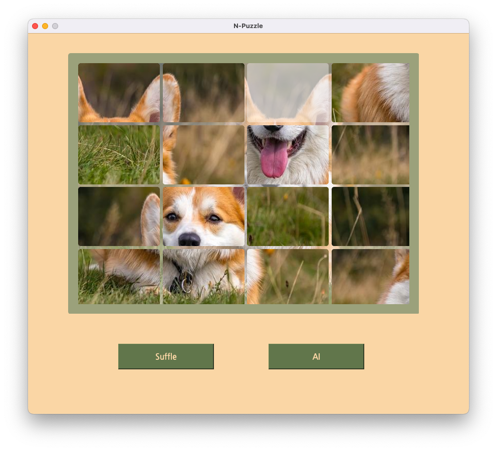

# N-Puzzle

> 대학 어드벤처 디자인 과제 中 8-Puzzle을 GUI로 구현  
> 난이도 : 8, 15, ... N-Puzzle  
> A\* Algorith을 사용. 자동으로 정답을 찾을 수 있음

https://user-images.githubusercontent.com/67590577/206560665-b83b1359-b0ac-429c-bb82-c12ceefc602b.mov

|            8-Puzzle            |           15-Puzzle           |
| :----------------------------: | :---------------------------: |
|   |  |
|            Shuffle             |            Shuffle            |
|  |  |
